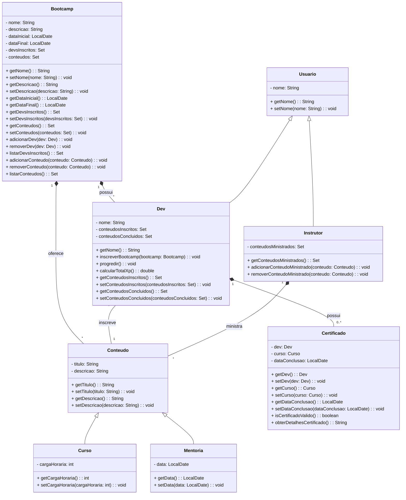

# Projeto  Abstraindo Bootcamp - Programação Orientada a Objetos (POO) 📕

> Este desafio tem como objetivo exercitar o conteúdo de Programação Orientada a Objetos (POO) utilizando Java, através da implementação de um uma simulação de um bootcamp.

## Objetivo 🎯
1. **Criação do Projeto em Java (`BootcampPOO`):**
   - Implementar os pilares da POO: Abstração, Encapsulamento, Herança e Polimorfismo.
   - Desenvolver classes que representem entidades do banco como Conta, Cliente e Transação.
   - Utilizar interfaces onde aplicável para definir comportamentos comuns.

2. **Funcionalidades Esperadas:**
   - Bootcamp: Classe principal que coordena as funcionalidades do bootcamp.
   - Curso: Representação de cursos oferecidos no bootcamp.
   - Conteudo (abstract): Classe abstrata para representar conteúdos educacionais.
   - Dev: Representação de desenvolvedores que participam do bootcamp.

## Diagrama UML 🖼️

