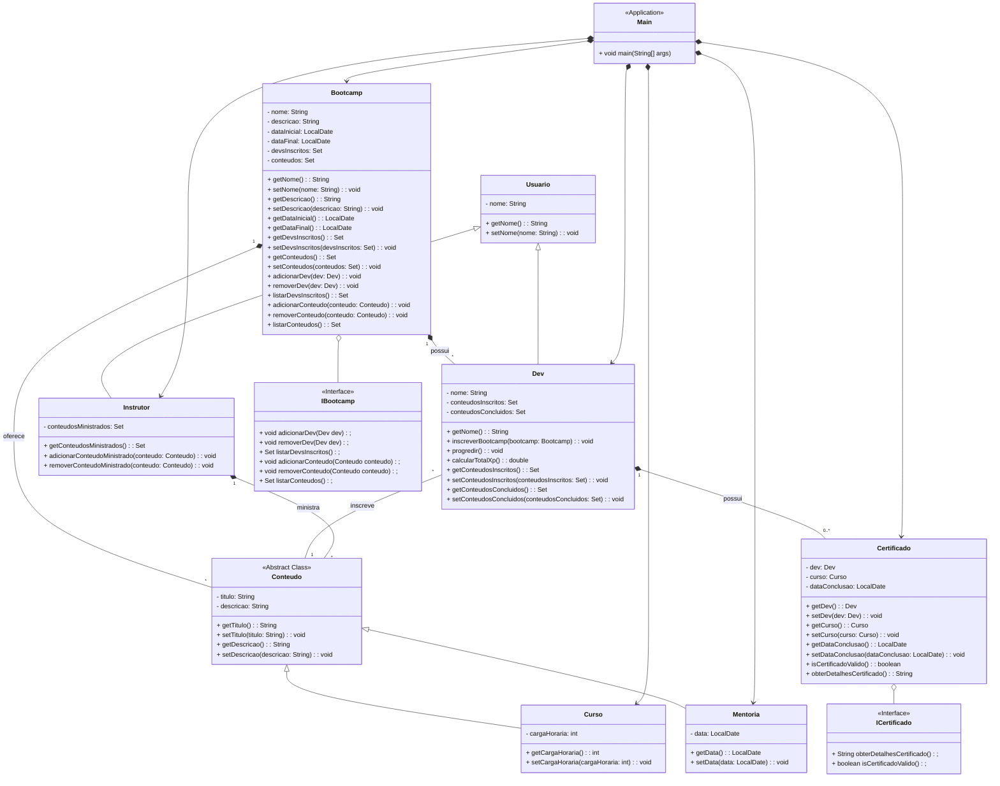

# Projeto  Abstraindo Bootcamp - Programação Orientada a Objetos (POO) 📕

> Este desafio tem como objetivo exercitar o conteúdo de Programação Orientada a Objetos (POO) utilizando Java, através da implementação de um uma simulação de um bootcamp.

## Objetivo 🎯
1. **Criação do Projeto em Java (`BootcampPOO`):**
   - Implementar os pilares da POO: Abstração, Encapsulamento, Herança e Polimorfismo.
   - Desenvolver classes que representem entidades do banco como Conta, Cliente e Transação.
   - Utilizar interfaces onde aplicável para definir comportamentos comuns.

2. **Funcionalidades Esperadas e Melhoradas:**
   - Bootcamp:
      - Adição e Remoção de Devs: Métodos para adicionar e remover Devs do Bootcamp. 📝
      - Adição e Remoção de Conteúdos: Métodos para gerenciar os conteúdos oferecidos pelo Bootcamp.  📘
      - Listagem de Participantes: Métodos para listar os Devs inscritos no Bootcamp. 📋
   - Curso:
      - Atributos: Além de título, descrição e carga horária, considerar também atributos como nível, pré-requisitos, etc. 📚
   - Conteudo (abstract):
      - Classe Abstrata: Definir métodos abstratos para acessar título e descrição, além de permitir a extensão para tipos específicos de conteúdo como Cursos e Mentorias. 🎓
   - Dev:
      - Inscrição no Bootcamp: Método para que os Devs possam se inscrever no Bootcamp. 🖊️
      - Progressão e XP: Métodos para avançar nos conteúdos e calcular a XP acumulada pelos Devs. 📈
   - Instrutor:
      - Relação com Conteúdos: Capacidade de ministrar diferentes tipos de Conteúdos no Bootcamp. 🎤
   - Usuario (superclasse):
      - Herança: Usar a classe Usuario como superclasse para Dev e Instrutor, abstraindo atributos comuns como nome. 🧑‍💻
   - Certificado:
      - Atributos: Atributos como Dev, Curso, e data de conclusão. 📜
      - Métodos: Implementar métodos para verificar a validade do certificado e obter detalhes do mesmo. 🏅
   - Interfaces (IBootcamp e ICertificado):
      - IBootcamp: Interface para definir métodos padrão de adição, remoção e listagem de Devs e Conteúdos em um Bootcamp. 📝
      - ICertificado: Interface para definir métodos padrão relacionados a Certificados, como verificar validade e obter detalhes. 📄

## Diagrama UML 🖼️

## Implementação do código Java💻
As classes e interfaces foram implementadas em Java e podem ser encontradas no diretório `src/br/com/poo`.

--------------------------------------------
> Aproveite o projeto e explore os conceitos de POO em Java no contexto de simulação de Bootcamp! 🎊
