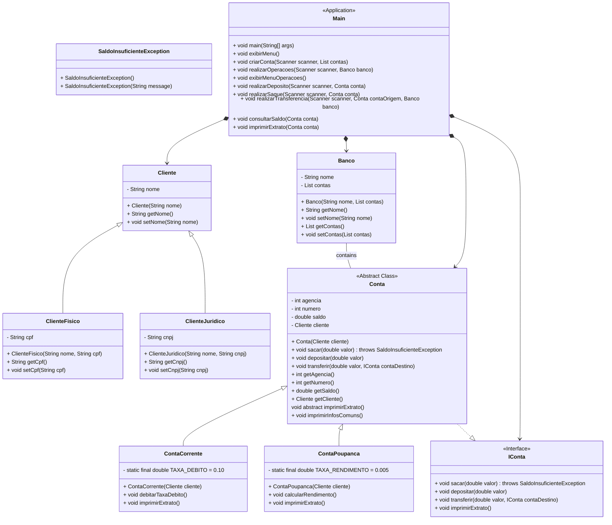

# Projeto Banco Digital - Programação Orientada a Objetos (POO) 🏦💻

> Este desafio tem como objetivo exercitar o conteúdo de Programação Orientada a Objetos (POO) utilizando Java, através da implementação de um banco digital.

## Objetivo 🎯
1. **Criação do Projeto em Java (`DigitalBankingPOO`):**
   - Implementar os pilares da POO: Abstração, Encapsulamento, Herança e Polimorfismo.
   - Desenvolver classes que representem entidades do banco como Conta, Cliente e Transação.
   - Utilizar interfaces onde aplicável para definir comportamentos comuns.

2. **Funcionalidades Esperadas:**
   - Criação de contas para novos clientes.
   - Realização de depósitos, saques e transferências entre contas.
   - Possibilidade de visualização do saldo e extrato da conta.

## Diagrama UML 🖼️

--------------------------------------------
> Aproveite o projeto e explore os conceitos de POO em Java no contexto de um banco digital! 🎊
