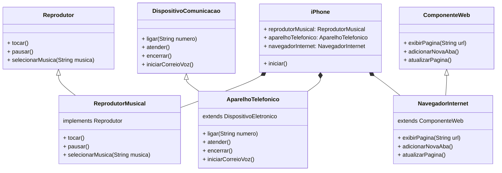

# Modelando o iPhone com UML: Funções de Músicas, Chamadas e Internet 📱

> Este desafio tem como objetivo exercitar o conteúdo de UML com Java, modelando e diagramando as funcionalidades do iPhone como Reprodutor Musical, Aparelho Telefônico e Navegador na Internet.

## Objetivo 🎯

**1. Criar um diagrama UML**
- O diagrama UML, deve representar as funcionalidades descritas abaixo :
  - Reprodutor Musical 🎵
    - **Métodos**: `tocar()`,`pausar()`, `selecionarMusica(String musica)`

  - Aparelho Telefônico 📞
    - **Métodos**: `ligar(String numero)`,`atender()`, `iniciarCorreioVoz()`

  - Navegador na Internet 🌐
    - **Métodos**: `exibirPagina(String url)`,`adicionarNovaAba()`, `atualizarPagina()`
    
**2. Implementar as classes e interfaces correspondentes em Java (Opcional)**
- Opcionalmente, implementar as classes e interfaces correspondentes código em Java.

## Diagrama UML 🖼️

## Implementação (Opcional) 💻
As classes e interfaces foram implementadas em Java e podem ser encontradas no diretório `src/br/com/iphone`.

## Referências 📚
- Vídeo do lançamento do iPhone 2007 (minutos relevantes: 00:15 até 00:55).

--------------------------------------------
> Pronto! Agora você pode visualizar e interagir com o programa, baseado no modelo UML implementado. 🎊
