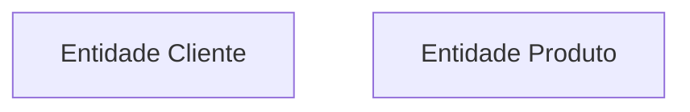
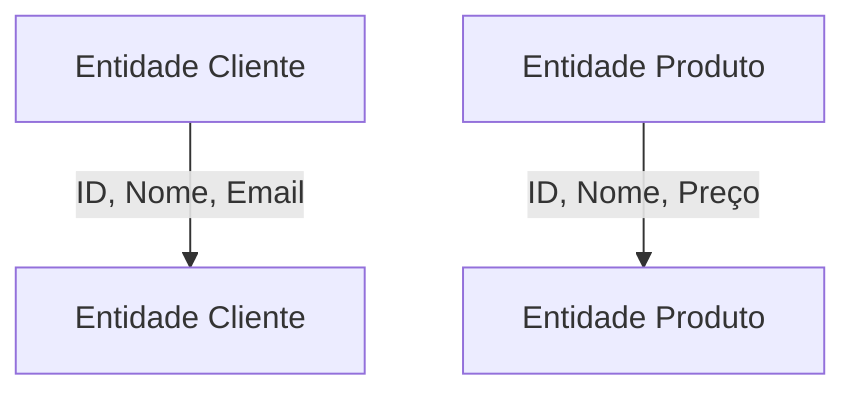
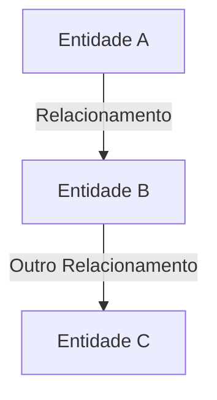
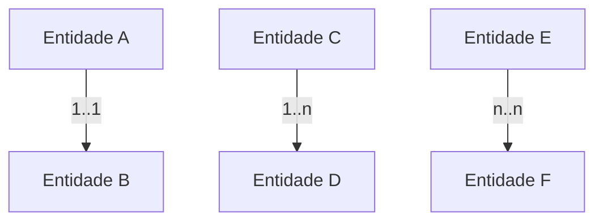

# Modelagem Entidade-Relacionamento (MER/DER) 🗂️

> Conhecendo a modelagem de dados para bancos de dados relacionais.

## MER x DER

A modelagem Entidade-Relacionamento (MER) e Diagrama Entidade-Relacionamento (DER) são termos usados de forma intercambiável e representam a mesma abordagem para projetar bancos de dados relacionais.

## Estrutura das Entidades e Relacionamentos 🏛️

### Entidades 📄

Entidades são objetos ou conceitos do mundo real que podem ser armazenados no banco de dados. Cada entidade possui atributos que descrevem suas características.

Exemplo de representação usando Mermaid:

### Atributos 🔍

Atributos são as propriedades ou características das entidades. Eles descrevem detalhes sobre uma entidade específica.

Exemplo de representação com atributos usando Mermaid:

### Relacionamentos ↔️

Relacionamentos definem como as entidades estão interligadas umas às outras no banco de dados. Podem ser uni ou bidirecionais.

Exemplo de representação de relacionamentos usando Mermaid:

### Cardinalidade 📊

A cardinalidade descreve o número de instâncias de uma entidade que podem ou devem estar associadas a instâncias de outra entidade. Vamos explorar os tipos principais:

- **1 para 1 (1..1):** Relação onde uma entidade está estritamente relacionada a uma única instância de outra entidade.
  
- **1 para muitos (1..n ou n..1):** Relação onde uma entidade está associada a várias instâncias de outra entidade, mas cada instância desta última está associada a apenas uma instância da primeira.

- **Muitos para muitos (n..n ou *..*):** Relação onde várias instâncias de uma entidade podem se relacionar com várias instâncias de outra entidade.

Exemplo de representação de cardinalidade usando Mermaid:

No exemplo acima:
- A relação entre **Entidade A** e **Entidade B** é de 1 para 1.
- A relação entre **Entidade C** (1) e **Entidade D** (n) é de 1 para muitos.
- A relação entre **Entidade E** (n) e **Entidade F** (n) é de muitos para muitos.

---

Este README.md fornece uma visão geral da modelagem Entidade-Relacionamento (MER/DER), explicando seus principais conceitos e demonstrando exemplos de representações usando o Mermaid.
