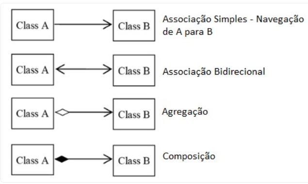
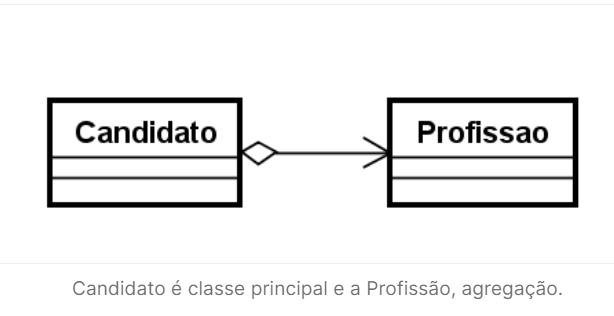
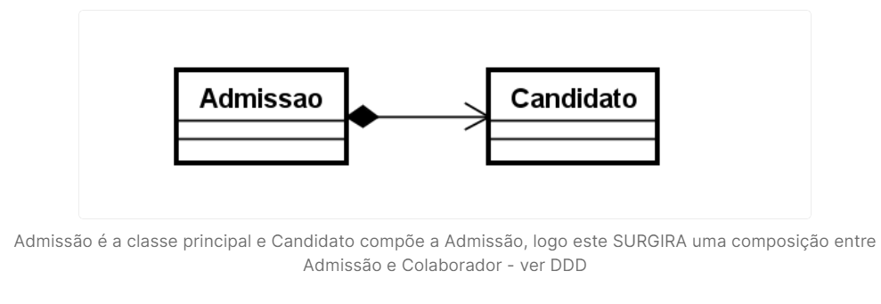
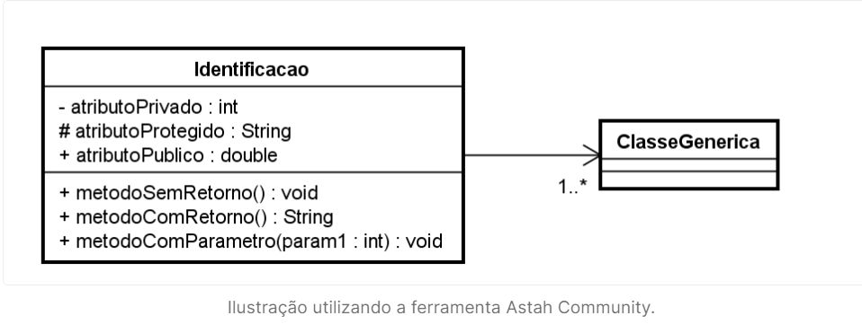

# UML - Linguagem de Modelagem Unificada 📝

A UML (Linguagem de Modelagem Unificada) é uma notação que possibilita a representação gráfica do projeto.

## Conceitos Básicos da UML 📚

### Diagramas, Elementos e Relacionamentos 📊🔗

As notações UML são distribuídas em duas categorias de diagramas: estruturais e comportamentais.

## Diagramas Estruturais 🏗️

### Diagrama de Classes 📚
O Diagrama de Classes é utilizado para fazer a representação de estruturas de classes de negócio, interfaces e outros componentes do sistema. Por esta característica, este diagrama é considerado o mais importante para a UML, pois auxilia a maioria dos demais diagramas.

### Diagrama de Objetos 🧩
Este diagrama representa os objetos existentes em um determinado instante ou fato na aplicação. Assim, conseguimos ter uma perspectiva do estado de nossos objetos, mediante a interação dos usuários no sistema.

> [!NOTE]  
> Existem outros tipos de diagramas estruturais na UML, como o Diagrama de Componentes, Diagrama de Estrutura Composta, Diagrama de Pacotes e Diagrama de Implantação, que também são importantes para a modelagem de sistemas complexos. No entanto, para o foco em projetos Java, os diagramas de Classes e Objetos são os mais utilizados.

## Diagrama de Classes 🖍️

O diagrama de classes ilustra graficamente como classes serão estruturadas e interligadas entre si, diante da proposta do nosso software.

Em diagrama, a estrutura das classes é constituída por:
- **Identificação**: Nome e/ou finalidade da classe;
- **Atributos**: Propriedades e/ou características;
- **Operações**: Ações e/ou métodos.

## Relacionamentos 🔄

### Associação 🔗
Uma associação define um relacionamento entre duas classes, permitindo que um objeto tenha acesso à estrutura de um outro objeto.

### Agregação 🧱
Em uma agregação, a classe principal contém uma relação com outra classe, mas ela pode existir sem a classe agregadora. Imagine um cadastro de Candidatos, podemos encontrar candidatos que ainda não possuam uma profissão:

- **Candidato** é a classe principal e a **Profissão** é a agregação.

### Composição ⚙️
A composição caracteriza uma dependência existencial entre a classe principal e a classe associada. Imagine que uma admissão só poderá existir contendo suas informações básicas e a composição do candidato selecionado:

- **Admissão** é a classe principal e **Candidato** compõe a Admissão, logo existe uma composição entre Admissão e Colaborador.

## Multiplicidade 🔢

Nem sempre o relacionamento entre as classes será de um para um. Em determinados cenários, poderá exigir multiplicidades específicas, conforme opções abaixo:
- `1` -> Representa uma associação contendo um elemento;
- `*` -> Representa uma associação contendo uma lista de elementos;
- `0..1` -> Representa uma associação contendo zero ou um elemento;
- `0..*` -> Representa uma associação contendo zero ou uma lista de elementos;
- `1..*` -> Representa uma associação contendo um ou uma lista de elementos.

## Visibilidade 👀

Os atributos e métodos de uma classe podem receber níveis de visibilidade, e na UML existem símbolos que representam cada um deles:
- `(+)` Visibilidade pública;
- `(#)` Visibilidade protegida (muito associada com herança);
- `(-)` Visibilidade privada.

## Representação 🖼️

## Ferramentas de Modelagem UML 🛠️

Existem diversas ferramentas populares para criar diagramas UML, incluindo:

- **Astah**: Ferramenta robusta para modelagem UML que suporta uma ampla variedade de diagramas.
    - [Site do Astah](https://astah.net/)
- **draw.io**: Ferramenta de diagramação online gratuita que inclui suporte para diagramas UML.
    - [Site do draw.io](https://draw.io/)
- **Lucidchart**: Plataforma de diagramação colaborativa que oferece recursos avançados para criação de diagramas UML.
    - [Site do Lucidchart](https://www.lucidchart.com/)
- **StarUML**: Ferramenta de modelagem UML moderna e de código aberto, adequada para diversos tipos de projeto de software.
    - [Site do StarUML](http://staruml.io/)

