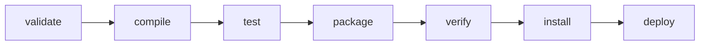

# 📝 Conceito de Apache Maven


## O que é Apache Maven? 🛠️

O Apache Maven é uma poderosa ferramenta de gerenciamento de projetos e automação de builds que fornece uma maneira padronizada de construir, empacotar, testar e implantar aplicações Java. Ele utiliza um modelo de configuração baseado em XML chamado `pom.xml` (Project Object Model) para descrever o projeto e suas dependências.

## Principais Conceitos 🌟

### 1. POM (Project Object Model) 📜
O `pom.xml` é o coração do Maven. Ele descreve os detalhes do projeto, como dependências, plugins, informações do projeto e configurações específicas de build.

### 2. Ciclo de Vida do Build 🔄
O Maven possui um ciclo de vida de build bem definido, dividido em fases. As fases principais são:
- **validate**: valida o projeto e verifica se todas as informações necessárias estão presentes.
- **compile**: compila o código fonte do projeto.
- **test**: testa o código compilado usando um framework de testes adequado.
- **package**: empacota o código compilado em um formato distribuível, como JAR ou WAR.
- **verify**: executa quaisquer verificações necessárias nos pacotes e valida os resultados.
- **install**: instala o pacote no repositório local, tornando-o disponível como uma dependência para outros projetos locais.
- **deploy**: copia o pacote final para o repositório remoto, compartilhando-o com outros desenvolvedores.

### 3. Dependências 🔗
O Maven facilita o gerenciamento de dependências, permitindo que você declare as bibliotecas que seu projeto necessita. Ele resolve automaticamente as dependências transitivas e baixa os arquivos necessários dos repositórios configurados.

```xml
<dependencies>
  <dependency>
    <groupId>org.springframework.boot</groupId>
    <artifactId>spring-boot-starter</artifactId>
    <version>2.5.0</version>
  </dependency>
</dependencies>
```

### 4. Plugins 🔌
Os plugins no Maven são usados para realizar tarefas durante o ciclo de vida do build. Eles podem compilar código, executar testes, criar pacotes, gerar documentação e muito mais.

```xml
<build>
  <plugins>
    <plugin>
      <groupId>org.apache.maven.plugins</groupId>
      <artifactId>maven-compiler-plugin</artifactId>
      <version>3.8.0</version>
      <configuration>
        <source>1.8</source>
        <target>1.8</target>
      </configuration>
    </plugin>
  </plugins>
</build>
```

### 5. Repositórios 🗄️
O Maven utiliza repositórios para armazenar dependências. Existem dois tipos principais de repositórios:
- **Local**: Um repositório no seu sistema de arquivos local, onde o Maven armazena as dependências baixadas.
- **Remoto**: Repositórios na internet, como o Maven Central, onde estão disponíveis bibliotecas de terceiros.

## Vantagens do Maven 💡
- **Gestão Automática de Dependências**: Facilita a inclusão e atualização de bibliotecas.
- **Padronização do Build**: Define um processo de build consistente e reproduzível.
- **Ampla Integração**: Integra-se com várias ferramentas de desenvolvimento, como IDEs, sistemas de CI/CD e mais.
- **Comunidade Ativa**: Possui uma grande comunidade que contribui com plugins, extensões e suporte.

## Exemplo de Estrutura de Projeto 📁

```plaintext
my-app
├── pom.xml
└── src
    ├── main
    │   └── java
    │       └── com
    │           └── example
    │               └── App.java
    └── test
        └── java
            └── com
                └── example
                    └── AppTest.java
```

## Diagrama de Ciclo de Vida do Build 🏗️



## Criando um Projeto Maven pelo Terminal 🖥️

Para criar um novo projeto Maven pelo terminal, siga os passos abaixo:

1. Abra o terminal.
2. Execute o comando para criar um novo projeto Maven:

```sh
mvn archetype:generate -DgroupId=com.example -DartifactId=my-app -DarchetypeArtifactId=maven-archetype-quickstart -DinteractiveMode=false
```

Este comando gera a estrutura básica de um projeto Maven usando o archetype `maven-archetype-quickstart`.

3. Navegue até o diretório do projeto criado:

```sh
cd my-app
```

4. Verifique a estrutura de diretórios e o arquivo `pom.xml` gerado:

```sh
tree .
```

---

## Conclusão 🎯

O Apache Maven é uma ferramenta indispensável para desenvolvedores Java, proporcionando uma maneira eficiente e padronizada de gerenciar projetos, dependências e processos de build. Com o Maven, você pode focar mais no desenvolvimento e menos na configuração do ambiente, tornando seu fluxo de trabalho mais produtivo e organizado.

---

Para mais informações, visite o [site oficial do Apache Maven](https://maven.apache.org/). 🌐

Para encontrar e adicionar dependências ao seu projeto, você pode usar o [Maven Central Repository](https://search.maven.org/). 🔍
