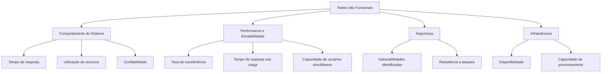

Para abordar os tópicos de Comportamento do Sistema, Performance, Escalabilidade, Segurança e Infraestrutura em Testes não Funcionais, aqui está um exemplo de estrutura inicial para o README:

---

# Sobre: Testes não Funcionais 📛

> Apronfundado em Testes não Funcionais.

## Comportamento do Sistema 🔄

### Definição
Os testes de Comportamento do Sistema visam avaliar como o software se comporta em diferentes condições operacionais e de uso.

### Objetivos
- Verificar a estabilidade do sistema sob diferentes cargas de trabalho.
- Avaliar a consistência e confiabilidade das operações.
- Identificar e mitigar possíveis problemas de desempenho.

### Métricas
- **Tempo de resposta**: Tempo que o sistema leva para responder a uma solicitação.
- **Utilização de recursos**: Monitoramento de CPU, memória e outros recursos durante operações normais e de pico.
- **Confiabilidade**: Taxa de falhas e tempo médio entre falhas (MTBF).

### Ferramentas
- Exemplos: JMeter, Gatling.

## Performance e Escalabilidade 🚀

### Definição
Testes de Performance avaliam como o sistema se comporta em termos de velocidade, estabilidade e escalabilidade.

### Objetivos
- Medir e otimizar o desempenho do sistema sob diferentes cargas de trabalho.
- Avaliar a capacidade de escalabilidade do sistema conforme o número de usuários ou volume de dados aumenta.

### Métricas
- **Taxa de transferência**: Quantidade de dados processados por unidade de tempo.
- **Tempo de resposta sob carga**: Avaliação do tempo de resposta em condições de carga máxima.
- **Capacidade de usuários simultâneos**: Quantidade máxima de usuários que o sistema suporta sem degradação significativa do desempenho.

### Ferramentas
- Exemplos: Apache JMeter, Locust.

## Segurança 🔒

### Definição
Testes de Segurança avaliam a robustez do sistema contra ameaças e vulnerabilidades.

### Objetivos
- Identificar e corrigir potenciais brechas de segurança antes que elas se tornem um problema real.
- Garantir que os dados sensíveis sejam protegidos de acesso não autorizado.

### Métricas
- **Vulnerabilidades identificadas**: Número de vulnerabilidades descobertas durante os testes.
- **Resistência a ataques**: Capacidade do sistema de resistir a tentativas de invasão.

### Ferramentas
- Exemplos: OWASP ZAP, Burp Suite.

## Infraestrutura 🛠️

### Definição
Testes de Infraestrutura avaliam a capacidade da infraestrutura de suportar o sistema em termos de disponibilidade e desempenho.

### Objetivos
- Garantir que os componentes de hardware e software da infraestrutura estejam configurados corretamente e sejam capazes de suportar a carga prevista.
- Identificar gargalos na infraestrutura que possam afetar o desempenho do sistema.

### Métricas
- **Disponibilidade**: Percentual de tempo que o sistema está disponível para uso.
- **Capacidade de processamento**: Capacidade de processamento dos servidores e recursos de rede.

### Ferramentas
- Exemplos: Docker, Kubernetes.

## Representação dos Testes Não Funcionais

