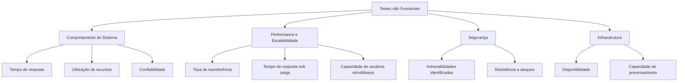

# Sobre: Testes não Funcionais 📛

> Apronfundado em Testes não Funcionais.

## Definição de Testes não Funcionais 🧩

Os testes não funcionais avaliam aspectos do sistema que não estão diretamente relacionados às funcionalidades específicas do software, mas sim à sua:

- **Performance** 🚀: Avaliação da velocidade, resposta e eficiência do sistema sob diferentes condições de carga.
  
- **Segurança** 🔒: Verificação dos mecanismos de proteção e segurança do sistema contra ameaças e ataques.
  
- **Escalabilidade** 📈: Capacidade do sistema de lidar com um aumento na quantidade de usuários, transações ou dados sem comprometer o desempenho.
  
- **Confiabilidade** ⚙️: Garantia de que o sistema seja estável e confiável em diferentes situações e ambientes.
  
- **Usabilidade** 👩‍💻: Avaliação da experiência do usuário, incluindo acessibilidade e interface intuitiva.
  
- **Manutenibilidade** 🛠️: Facilidade com que o sistema pode ser mantido e modificado após o lançamento.

Esses testes são essenciais para garantir que o sistema atenda não apenas aos requisitos funcionais, mas também aos requisitos de desempenho e qualidade exigidos pelos usuários e pela organização.

## Representação dos Testes Não Funcionais

### Teste de Carga 📊

- **Definição**: Avalia o comportamento do sistema sob condições de carga significativa para determinar sua estabilidade e desempenho.

- **Objetivos**:
  - Medir o tempo de resposta do sistema sob diferentes volumes de transações.
  - Avaliar a capacidade do sistema de manter o desempenho esperado durante picos de uso.
  - Identificar gargalos de desempenho e otimizar recursos para melhorar a capacidade de resposta.

- **Benefícios**:
  - Garantir que o sistema mantenha o desempenho aceitável mesmo durante períodos de alta demanda.
  - Validar a escalabilidade do sistema conforme o número de usuários e transações aumenta.
  - Prevenir falhas críticas devido a sobrecarga ou subdimensionamento dos recursos.

### Teste de Stress 🌪️

- **Definição**: Avalia o comportamento do sistema sob condições extremas de carga além dos limites especificados, para determinar seu ponto de ruptura.

- **Objetivos**:
  - Testar a estabilidade do sistema sob carga máxima ou acima dos limites normais.
  - Identificar como o sistema se comporta diante de condições de uso intenso por longos períodos.
  - Verificar se o sistema pode se recuperar adequadamente após períodos de estresse.

- **Benefícios**:
  - Revelar vulnerabilidades e pontos fracos do sistema que só se manifestam sob extrema pressão.
  - Permitir ajustes para melhorar a robustez e a capacidade de recuperação do sistema.

### Teste de Segurança 🔒

- **Definição**: Avalia a resistência do sistema contra tentativas de invasão, falhas de segurança e proteção dos dados.

- **Objetivos**:
  - Identificar vulnerabilidades e falhas de segurança que possam ser exploradas por invasores.
  - Garantir que os mecanismos de segurança implementados estejam eficazes e atualizados.
  - Proteger dados sensíveis contra acesso não autorizado e ataques maliciosos.

- **Benefícios**:
  - Minimizar riscos de exposição de dados e violações de segurança.
  - Reforçar a confiança dos usuários na proteção de suas informações pessoais e transações.

Esses testes não funcionais são cruciais para garantir que o sistema seja seguro, confiável, eficiente e capaz de atender às expectativas dos usuários em termos de desempenho e segurança.
