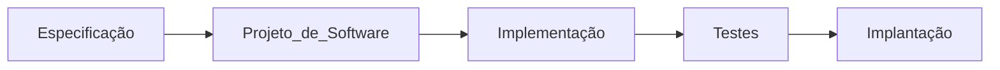
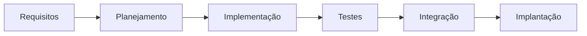
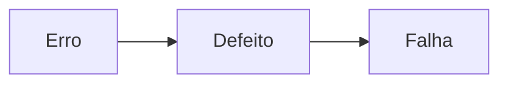

# 📝 Introdução a Testes de Software
> Conhecendo: Teoria Testes de código.

## Índice

1. [O que é um Teste?](#o-que-é-um-teste-)
2. [Evolução de Testes na Engenharia de Software](#evolução-de-testes-na-engenharia-de-software-)
   - [Modelo Cascata](#modelo-cascata)
   - [Desenvolvimento Ágil](#desenvolvimento-àgil)
3. [Conceitos Básicos de Testes de Software](#conceitos-básicos-de-testes-de-software-)
   - [Terminologia](#terminologia-)
     - [Defeito, Erro, Falha](#defeito-erro-falha)
     - [Verificação vs Validação](#verificação-vs-validação)
     - [Estático vs Dinâmico](#estático-vs-dinâmico)
---

## O que é um Teste? 🧪
Um teste de software é um processo realizado para identificar a qualidade e a conformidade de um sistema em relação aos requisitos especificados. Ele ajuda a garantir que o software atenda aos padrões de qualidade esperados antes de ser lançado para os usuários finais.

---

## Evolução de Testes na Engenharia de Software 🚀
Os testes de software evoluíram significativamente desde os métodos iniciais até as práticas modernas. Esta seção explora como os testes passaram de procedimentos manuais simples para técnicas automatizadas avançadas, acompanhando o crescimento da engenharia de software.

### Modelo Cascata

No modelo cascata, um dos primeiros modelos de desenvolvimento, os testes eram realizados apenas no final do ciclo, após a implementação. Era uma abordagem sequencial com foco em testes manuais das funcionalidades finais. Com o tempo, este modelo foi substituído por metodologias ágeis que incorporam testes contínuos ao longo do ciclo de vida do software.

### Desenvolvimento Ágil 🏃‍♂️

No Desenvolvimento Ágil, os testes são integrados ao longo de todo o ciclo de vida do software, em contraste com o modelo cascata. Esta abordagem promove iterações rápidas e feedback contínuo, permitindo ajustes e melhorias constantes no software. Os testes são automatizados sempre que possível, o que aumenta a eficiência e a confiabilidade do processo de desenvolvimento.

---

## Conceitos Básicos de Testes de Software 📘
Os conceitos básicos são fundamentais para entender os testes de software. Aqui, você aprenderá os termos essenciais, tipos de testes e as principais abordagens utilizadas para verificar a funcionalidade e a performance do software.

### Terminologia 🔤

#### Defeito, Erro, Falha
- **Erro**: Também chamado de "engano", é uma ação humana que produz um resultado incorreto. ❌
- **Defeito**: Também conhecido como "falha" ou "bug", é uma imperfeição no produto de trabalho, como código, causada por um erro. 🐞
- **Falha**: Evento causado por um defeito no qual um sistema, ou parte dele, não executa uma função conforme os requisitos estabelecidos. 🚫

#### Verificação vs Validação
- **Verificação**: Processo de avaliar se o produto de software cumpre as especificações e requisitos durante as fases de desenvolvimento. 📐
- **Validação**: Processo de avaliar se o software atende às necessidades e expectativas do usuário final quando em uso. 🎯
  
#### Estático vs Dinâmico
- **Teste estático**: Análise do código sem a necessidade de execução, como revisões de código. 📝
- **Teste dinâmico**: Envolve a execução do código para validar seu comportamento. 🏃‍♂️
