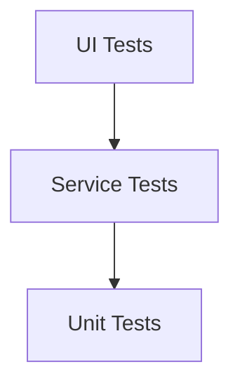

# Sobre: Pirâmide de Testes 🔼

> Aprofundamento na Pirâmide de Testes.

## Conceito

A Pirâmide de Testes é um modelo que ilustra a distribuição ideal dos diferentes tipos de testes em um processo de desenvolvimento de software. A estrutura da pirâmide sugere que os testes devem ser organizados em diferentes níveis, com base na quantidade e no tipo de testes realizados em cada nível. A representação reorganizada da Pirâmide de Testes é dividida em três camadas principais:

### Explicação da Pirâmide de Testes

- **UI Tests** 🖥️: Testes que validam a interface do usuário e as interações visuais. Eles garantem que a interface do usuário funcione conforme o esperado para o usuário final. Quanto mais próximo dos UI Tests, mais lento é o tempo de execução devido à complexidade das interações visuais.

- **Service Tests** 🚀: Testes que verificam a funcionalidade dos serviços e APIs. Eles garantem que os serviços fornecidos pelo sistema estejam funcionando corretamente. Quanto mais próximo dos Service Tests, mais rápido é o tempo de execução, pois esses testes lidam com lógica de negócios e operações de back-end.

- **Unit Tests** 🧪: Testes que verificam unidades individuais de código, como funções ou métodos, isoladamente. São rápidos de executar e identificam erros no nível de código.

### Benefícios da Pirâmide de Testes

- **Cobertura Abrangente** 🎯: Garante uma cobertura completa dos diferentes níveis de testes, desde unidades individuais até cenários complexos de uso.
  
- **Rápida Identificação de Defeitos** 🛠️: Testes mais básicos, como os unitários, identificam problemas no código logo no início do ciclo de desenvolvimento.

- **Redução de Custos** 💰: Concentra a maior parte dos testes nos níveis inferiores, que são mais econômicos de automatizar e executar repetidamente.

- **Garantia de Qualidade** ⭐: Melhora a confiabilidade do software ao validar funcionalidades em vários níveis antes do lançamento.

Esta organização da Pirâmide de Testes ajuda a equilibrar a cobertura de testes e otimizar a eficiência no processo de desenvolvimento de software, garantindo que o produto final atenda aos padrões de qualidade esperados.
